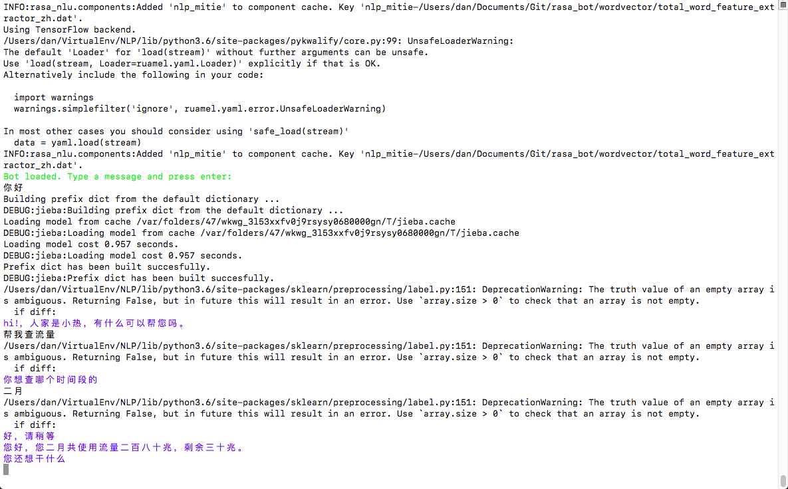
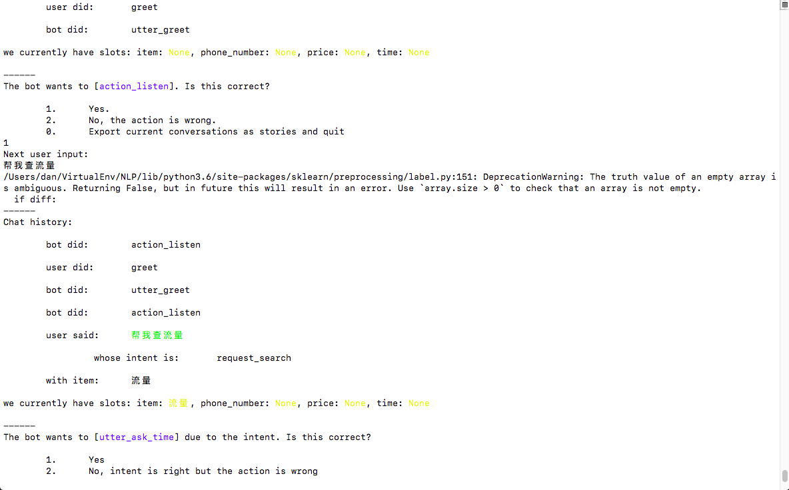

# 整理：基于Rasa-NLU和Rasa-Core的任务型ChatBot

## 组件版本
1. Python 3
2. TensorFlow 1.8.0
3. Keras 2.2.2
4. jieba 0.39
5. scikit-learn 0.19.1
6. mitie 0.5.0 (安装方式：pip install git+https://github.com/mit-nlp/MITIE.git)
7. rasa-nlu 0.13.1
8. rasa-core 0.10.4

## 资料来源
1. MITIE预训练词向量，使用中文维基百科训练。
2. rasa-nlu和rasa-core示例配置和语料 来自：[https://github.com/zqhZY/_rasa_chatbot](https://github.com/zqhZY/_rasa_chatbot)
这里仅整理为一个完整的包含NLU、Dialog训练和测试，ChatBot在线学习和使用的例子。

## 准备工作
1. git clone https://github.com/Ma-Dan/rasa_bot
2. 下载MITIE预训练词向量total_word_feature_extractor.dat，并放入rasa_bot/wordvector目录，下载链接：https://pan.baidu.com/s/1RvKKC5X1cd6oovMKEbInXg 密码: 81jn
3. （可选）使用自己训练的MITIE词向量，方法：[http://blog.rubenxiao.com/posts/nlp-mitie.html](http://blog.rubenxiao.com/posts/nlp-mitie.html)

## 训练和测试
### Rasa-NLU训练
```shell
python bot.py train-nlu
> INFO:rasa_nlu.training_data.loading:Training data format of data/nlu.json is rasa_nlu
> INFO:rasa_nlu.training_data.training_data:Training data stats: 
> 	- intent examples: 169 (13 distinct intents)
> 	- Found intents: 'inform_other_phone', 'inform_current_phone', 'unknown_intent', 'goodbye', 'thanks', 'inform_time', 'inform_item', 'greet', 'request_management', 'confirm', 'inform_package', 'deny', 'request_search'
> 	- entity examples: 102 (4 distinct entities)
> ...
> Part I: train segmenter
> ...
> Part II: train segment classifier
```
### Rasa-NLU测试(API调用测试，可用于前端程序调用Rasa-NLU服务)
```shell
python -m rasa_nlu.server -c data/nlu_model_config.json --path models
curl -XPOST localhost:5000/parse -d '{"q":"你好", "project":"ivr", "model":"demo"}'
```
### Rasa-Core训练
```shell
python bot.py train-dialogue
```
### Rasa-Core测试(API调用测试，可用于前端程序调用ChatBot服务)
```shell
python -m rasa_core.server -p 5005 -d models/dialogue -u models/ivr/demo -o out.log
curl -XPOST localhost:5005/conversations/default/parse -d '{"query":"帮我查话费"}'
curl -XPOST localhost:5005/conversations/default/continue -d '{"executed_action": "utter_greet", "events": []}'
```
### ChatBot测试(命令行直接跟ChatBot对话)
```shell
python bot.py run
```

### ChatBot在线学习(命令行交互训练ChatBot对话)
```shell
python bot.py run online-train
```

